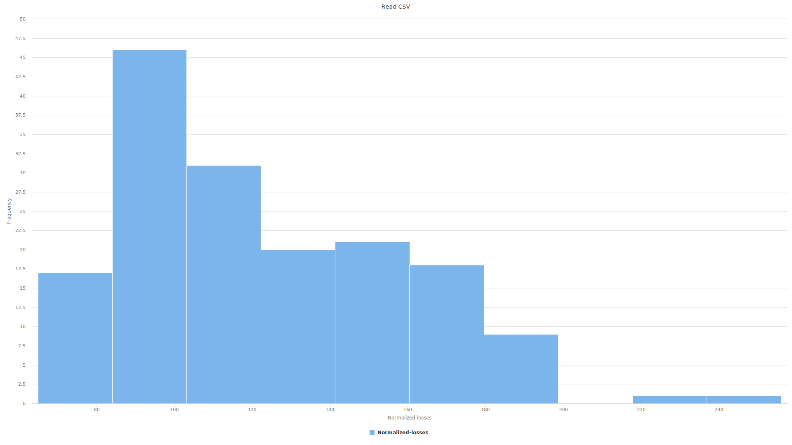
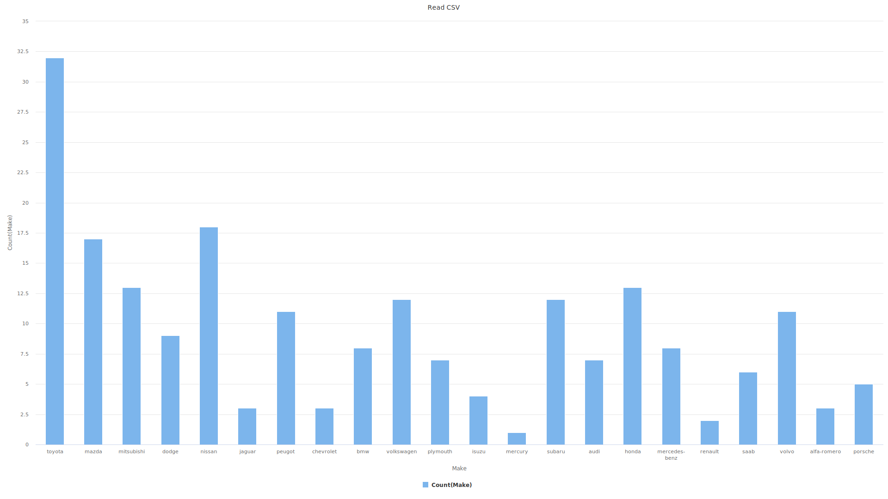
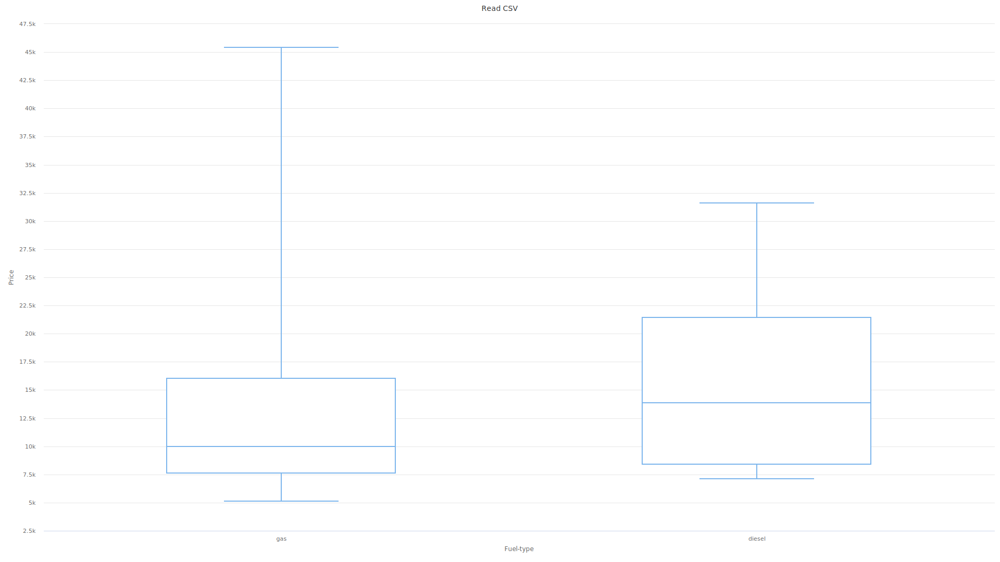
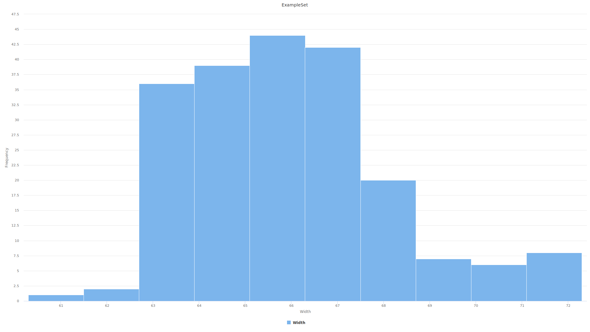
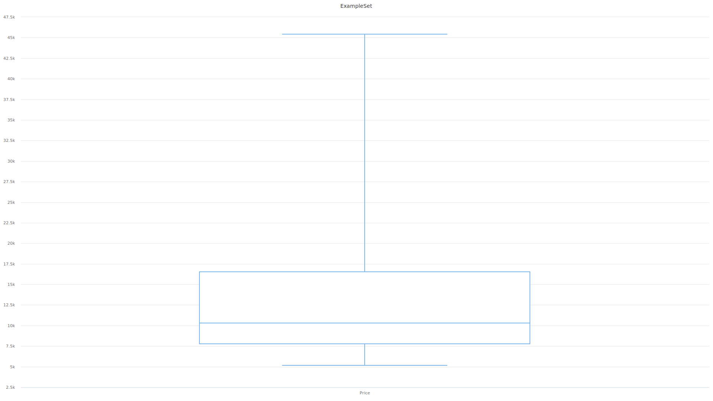
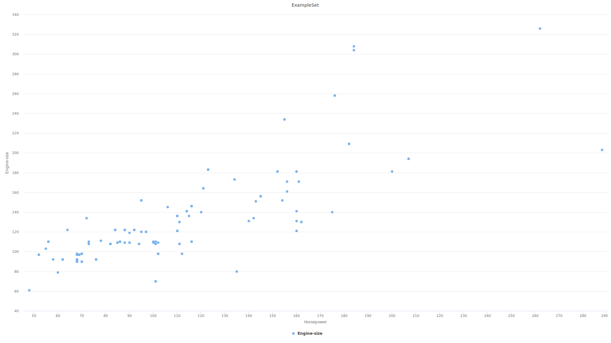
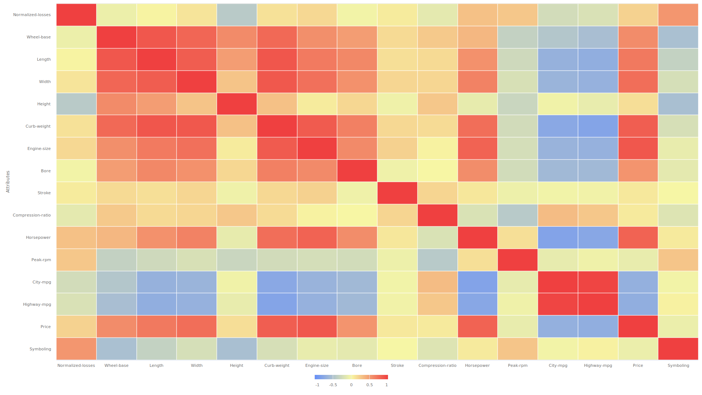
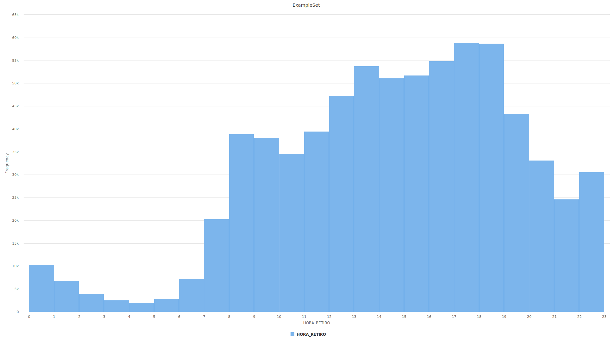

# Práctica 1: Preprocesamiento de los datos

### 1. Automóviles

Analice la información del archivo automobile.csv cuyo contenido se encuentra descripto en “automobile_names.txt”
1. Indique qué tipo de gráfica puede construir con los atributos. Ejemplifique cada caso.
2. Utilizando distintas representaciones gráficas, describa la distribución de los atributos, e indique si observa relaciones entre los mismos.
3. La Minería de Datos permite extraer dos tipos de conocimiento: descriptivo y predictivo. Ejemplifíquelos para el caso de los autos.
4. Calcule el coeficiente de correlación lineal entre los atributos numéricos. Relacione los valores obtenidos con los diagramas de dispersión de cada par de atributos.

### Resolución
#### Punto 1

 Hay que tener en cuenta el tipo de variable (categórica, continua). Para las variables **continuas** tales como _normalized-losses_, _wheel-base_, _length_, _height_, etc podría realizar gráficas tales como histogramas, box plots, gráfico de dispersión para explorar relaciones entre pares de variables continuas o mapa de calor para visualizar la correlación entre todas las variables continuas. 

Para las variables **categóricas** tales como _symboling_, _make_, _fuel-type_, etc, se podría realizar gráficos de barra o gráficos de torta.

También se podría realizar gráficas para analizar la relación entre las variables categóricas y continuas, como un diagrama de cajas apiladas por ejemplo, o bien podría realizarse una exploración en general podría realizarse un diagrama de correlación.

**Algunos gráficos de ejemplo**:

#### Punto 2:

Para analizar la distribución de los atributos, además de observar el resumen de los mismos que proporciona rapidminer (media, desviación estandard, max, min), para los atributos númericos se puede realizar un histograma. Por ejemplo para el atributo *width* se puede observar que los datos se distribuyen de manera cercana a la normal, teniendo un pico alrededor de la media (65.908).

Una alternativa a los histogramas además son los diagramas de cajas. Por ejemplo para el atributo price se puede ver que el mismo posee un dato con precio 45400 que en si podría considerarse anómalo. Sin realizar un análisis mas proundo del mismo, no se puede inferir si este es anómalo pero correcto (quizás se podría tratar de un auto de gama alta muy caro) o un dato erróneo.

También se puede inferir la relación entre dos atributos numéricos mediante un gráfico de dispersión. Por ejemplo en el siguiente gráfico se puede ver en el eje y el tamaño del motor (*engine-size*) y en el eje x los caballos de fuerza (*horsepower*). En general puede verse que la mayoría de los datos están comprendidos (zona más densa) en valores de *engine-size* y *horsepower* cercanos al promedio, y que al aumentar el tamaño del motor, aumenta los caballos de fuerza que posee el vehiculo, aunque estos parecen ser menos comunes.

#### Punto 3:

Para el caso descriptivo, se intentará mostrar nuevas relaciones entre las variables, por ejemplo en este caso podría obtenerse las marcas de autos mas comúnes o visualizar la relación entre el precio del auto comparado a los caballos de uerza que el mismo posee.

Para el caso predictivo, implica utilizar modelos para predecir valores futuros o clasificar datos en categorías. Por ejemplo dados diferentes valores de los atributos del auto (caballos de fuerza, tamaño del motor, marca, etc) se podría construir un modelo que reciba estos datos de entrada y asi predecir el precio del auto.

#### Punto 4:

En la siguiente figura se puede visualizar la matriz de correlación

En la misma se puede observar por ejemplo que como se infería en el gráfico de dispersión, hay una correlación lineal fuerte positiva entre *horsepower* y *engine-size* (0.811). Además se puede ver una correlación lineal fuerte negativa entre *horsepower* y *City-mpg*, con lo cual si *horsepower* aumenta, *City-mpg* disminuirá.

### 2. Bicis

En el siguiente [link](https://recursos-data.buenosaires.gob.ar/ckan2/bicicletas-publicas/recorrido-bicis2016.csv) encontrará información referida al uso de bicicletas que el Gobierno de la Ciudad de Buenos Aires pone a disposición de la población en forma gratuita como medio de transporte. Estas bicicletas están ubicadas en distintos puntos de la ciudad y se encuentran disponibles las 24 horas del día durante todo el año. En el archivo encontrará información referida a las estaciones de origen y destino, la hora de partida y la duración de los viajes realizados por las bicicletas durante el año 2016

1. A partir del atributo FECHA_HORA_RETIRO genere un atributo nuevo que
contenga únicamente el horario en el cual la bicicleta fue retirada. Para ello puede obtener el substring que contiene la hora con las funciones de texto de **GenerateAttributes**, y luego convertir ese substring a un número entero con el mismo operador. También puede utilizar la función *date_parse* de **GenerateAttributes** para convertir el string a un tipo date, y luego utilizar *date_get* para obtener la hora.

2. Utilizando un histograma donde cada hora represente una barra, informe si hay horarios inusuales de retiro de bicicletas. Justifique su respuesta utilizando la frecuencia relativa de cada hora para decidir qué es un horario inusual (datos) y en qué horas tradicionalmente circula la gente por una ciudad (su conocimiento sobre el dominio)

3. Indique el valor de verdad de la siguiente proposición: “Se obtendrán los mismos resultados si se discretiza por rango el atributo generado en a) utilizando 4 intervalos que si se lo discretiza por frecuencia utilizando 4 intervalos”. Justifique su respuesta.

### Resolución
#### Punto 2:

El histograma obtenido es el siguiente:

